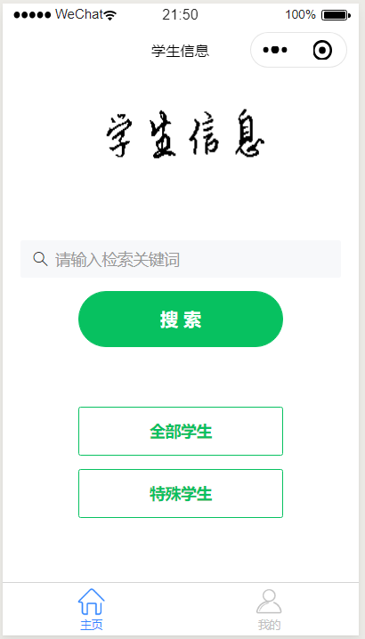
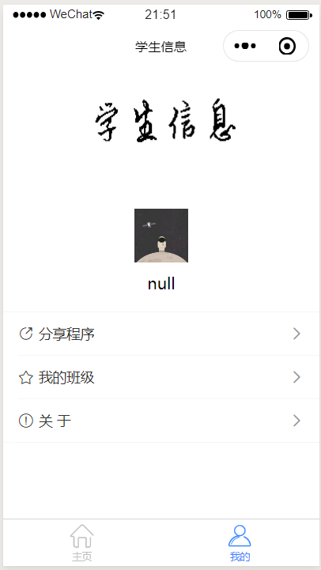
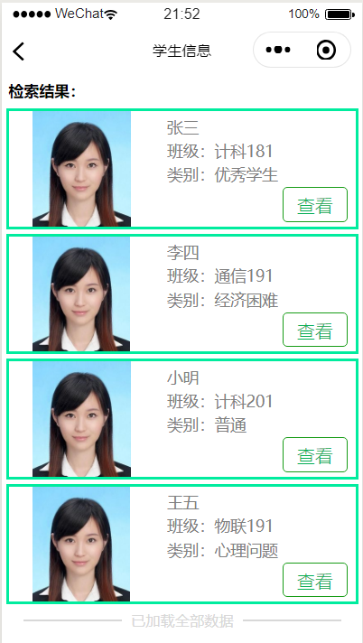
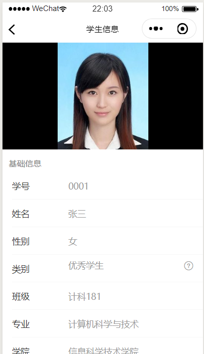

# 学生信息管理系统——微信小程序端
学生信息管理系统，微信小程序前端，需配合[学生信息管理系统后端](https://github.com/weingxing/StudentInfo-backend)使用

## 部署说明

克隆项目，使用微信小程序开发工具导入项目，修改项目appid为你申请的appid，修改**util/api.js**中的domain为**你的后端地址**即可。

## 部分功能截图

#### 首页截图：

#### “我的”页面：

##### 学生信息页面截图：

#### 详细信息页面截图：

